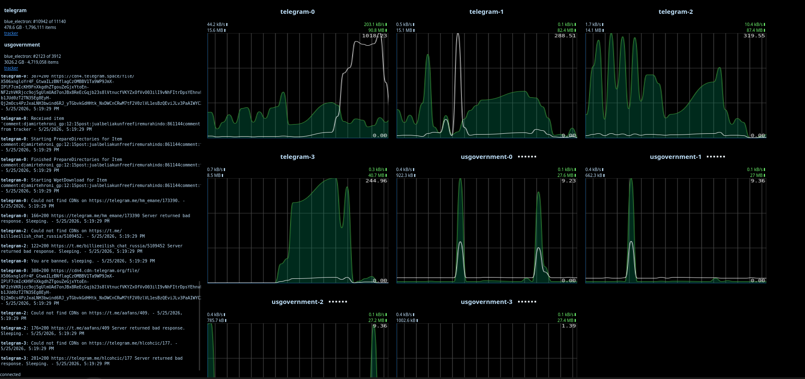

# Archive Team Warrior Dashboard

> **Note:** This repository contains AI-generated code. The Go backend server was AI-generated and then cleaned and tweaked by hand. 



atw-dashboard is an all-in-one solution for running and monitoring ArchiveTeam Warriors at scale. Deploy a fleet of warriors and a dashboard on Docker or Kubernetes in minutes. 

## Architecture
A Go backend server connects to all deployed warriors and streams their logs and network activity graphs to unified frontend dashboard. 

## Docker Installation

A Docker compose stack is provided in `install/docker/`. 

```bash 
git clone git@github.com:jordanbecketmoore/atw-dashboard.git
cd atw-dashboard/install/docker
docker compose up -d
```

## Kubernetes Installation

A Helm chart is provided in `install/helm/` and published to GHCR as an OCI artifact.
It deploys both the dashboard (Deployment + Service + ConfigMap) and the warriors
themselves (one StatefulSet per project, fronted by headless Services on the
cluster-internal network).

**Install from OCI (recommended):**

```sh
helm install atw oci://ghcr.io/jordanbecketmoore/atw-dashboard --version <version> -f my-values.yaml
```

To see available versions, check the [releases page](https://github.com/jordanbecketmoore/atw-dashboard/releases).

**Install from local chart:**

```sh
git clone git@github.com:jordanbecketmoore/atw-dashboard.git
helm install atw .atw-dashboard/install/helm
```

Minimal `values.yaml`:

```yaml
warriors:
  nickname: your-nickname
  projects:
    - name: usgovernment
      replicas: 2

dashboard:
  image:
    repository: jordanbmoore/atw-dashboard
    tag: latest
  httproute:
    enabled: true
    parentRefs:
      - name: my-gateway
        namespace: gateway
    hostnames:
      - atw.example.com
```

The chart generates the dashboard `config.yaml` from `warriors.projects`,
naming each warrior `<project>-<index>` and pointing at
`http://<project>-warrior-<index>:8001`.

Notes:

- The hub is in-memory and warrior connections are stateful — the dashboard
  Deployment is pinned to `replicas: 1` with a `Recreate` strategy.
- External exposure uses the Gateway API (`HTTPRoute`), gated by
  `dashboard.httproute.enabled`. Bring your own `Gateway`.
- Warrior Services are cluster-internal only — they are not exposed via the
  HTTPRoute.

## Configuration

The backend reads YAML from `-config` (default `/etc/atw-dashboard/config.yaml`).
See `config.example.yaml`:

```yaml
listen_addr: ":8080"
nickname: "your-nickname"          # operator nick used for leaderboard lookups
leaderboard_interval: 5m
warriors:
  - name: warrior-1
    url: http://warrior-1.warriors.svc.cluster.local:8001
  - name: warrior-2
    url: http://warrior-2.warriors.svc.cluster.local:8001
```